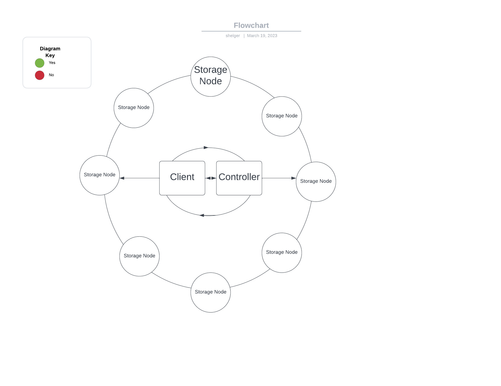

# Project 1: Distributed File System

1. Components and Features: 
  i. Parallel storage/retrieval 
  ii. Interoperability 
  iii. Fault Tolerance 
      Replicas
2. Diagram: 
  

| From | Buffer | To |
| -------- | -------- | -------- |
| Storage Node | Sn - Tell controller the node has been added  | Controller |
| Storage Node | Hb - Heartbeat | Controller |
| Client | put/get/info/ls - Get nodes information from controller | Controller |
| Client | put/get - Communicate with nodes | Storage Node |
| Storage Node | response - Provide resources for client | Client |
3. Command Line: 
  ./client  
  put <filename> (<number_of_chunks> optional)          store files into nodes 
  get <filename>                                        retrive data from nodes 
  delete <filename>                                     delete files and their duplicates in the nodes 
  ls                                                    list the nodes storing files 
  info                                                  log the space of the disk in GB, active nodes, and how many requests are handled by the node 

To Start the project: 
Suppose you are in the path of main dir of the project 
  Step 1: Run the controller.go in the controller dir 
          $go run controller/controller.go 
  Step 2: Run as many as Orion machines you like 
          $go run storageNodes/storageNode.go 
  Step 3: Run client applications 
          $go run client put/get/delete/ls/info .... 

          
Or easily apply by: 
  Step 1: $./startup.sh 
  Step 2: $go run client put/get/delete/.... 
  Step 3: $./stop.sh 
